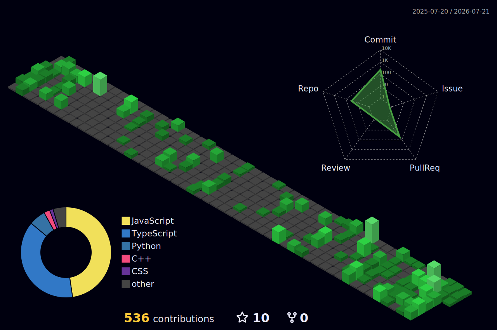

<!-- Profile README: Pratyush Sharma (pratyush3188) -->

  

  

 

---

# 🧭 The short story

I build products with a simple loop: understand the problem, cut the noise, and ship clean software that users can trust. As a frontend developer growing into full-stack, I move from interface to infrastructure with the same question in mind: how do we make this simpler, faster, and easier to evolve tomorrow?

- **Core stack**: TypeScript • Next.js • React • Node.js • Express • MongoDB • Tailwind CSS • Python
- **Strengths**: component-driven UIs, full-stack web apps, AI-powered tools, open-source NPM packages, end-to-end ownership from idea to deployment
- **Exploring**: DSA & competitive programming, system design patterns, DevOps & cloud infrastructure, real-time WebSocket applications

> I value clarity over cleverness, small fast iterations over big promises, and code that explains itself.

---

## 🧩 Strengths at a glance

- **Front‑end craft**: Component‑driven UX in React + TypeScript; clean hooks and predictable state
- **Full‑stack projects**: Megablock, Blogify, Uber Clone, Next.js Polling App — built end to end
- **AI integration**: VedaAI — simplifies complex reports using AI; Medical Triage system
- **NPM publishing**: Built & published `pratyushform` package on NPM
- **Open source**: Active contributor at IAESTE LC JECRC — official website & member portal
- **DSA practice**: Consistent problem solving with Striver's & Kunal Kushwaha's sheets

---

## 🧰 Toolbox

  
  
  
  
  
  
 

  
  
  
  
  
  

  
  
  
  
  
  

---

## 🐍 Contribution Snake

  <picture>
    <source media="(prefers-color-scheme: dark)" srcset="https://raw.githubusercontent.com/pratyush3188/pratyush3188/output/github-snake-dark.svg" />
    <source media="(prefers-color-scheme: light)" srcset="https://raw.githubusercontent.com/pratyush3188/pratyush3188/output/github-snake.svg" />
    
  </picture>

## 🧊 3D Contribution Graph

  

## 📊 GitHub Stats

  
  

  

  
  

  
  

## 🔗 Let's connect

  
  
  

  

